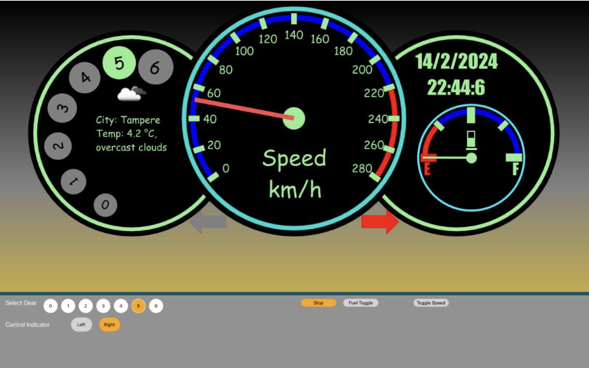

# Car Dashboard Application

## Overview
The Car Dashboard Application is a comprehensive interface that displays essential vehicle metrics, including **speed**, **fuel level**, **gear position**, **turn indicators**, **time**, **date**, and **weather information** for the vehicle's current location. The dashboard was developed using **Qt Quick** and **QML**, leveraging their rich graphical user interface capabilities to create an interactive and visually appealing design.

---

## Key Features

### 1. **Speedometer**
- A central speedometer that dynamically updates the vehicle's speed.
- Clear and intuitive design with real-time responsiveness.

### 2. **Fuel Gauge**
- Displays the current fuel level using a circular gauge.
- Provides a visual representation of fuel consumption over time.

### 3. **Gear Position**
- An interactive gear display showing the selected gear (e.g., 1, 2, 3, etc.).
- Highlighted indicators for the current gear position.

### 4. **Turn Indicators**
- Left and right directional indicators activated through the control panel.
- Provides visual feedback for turn signals.

### 5. **Time and Date**
- Displays the current date and time on the dashboard.
- Automatically updates to remain accurate in real-time.

### 6. **Weather Information**
- Displays weather details for the vehicle's location, including:
  - **City name**.
  - **Temperature**.
  - **Weather conditions** (e.g., sunny, overcast).

---

## User Interface Design
The dashboard features a clean and user-friendly layout with the following components:
1. **Left Pane**:
   - Gear display and weather information.
2. **Center Pane**:
   - Speedometer with a clear "km/h" unit.
3. **Right Pane**:
   - Date and time display.
   - Fuel level gauge.

The background gradient enhances the visual appeal, ensuring optimal readability in various lighting conditions.

---

## Interactive Controls
The application includes a control panel at the bottom of the interface:
- **Gear Selector**: Allows users to switch between different gears.
- **Control Indicators**: Toggle left or right turn signals.
- **Additional Toggles**:
  - Fuel state toggle.
  - Speed toggle.
  - Stop button to reset metrics.

---

## Technologies Used
- **Qt Quick**: For creating a responsive and visually appealing interface.
- **QML**: For designing and implementing the application logic and layout.
- **Animation and Transitions**: Smooth animations for speedometer needle, turn indicators, and gear transitions.

---

## Summary
This Car Dashboard Application provides an all-encompassing interface to monitor and interact with essential vehicle metrics. Its visually rich and interactive design ensures a seamless user experience, making it a robust solution for in-vehicle displays or automotive simulation projects.
